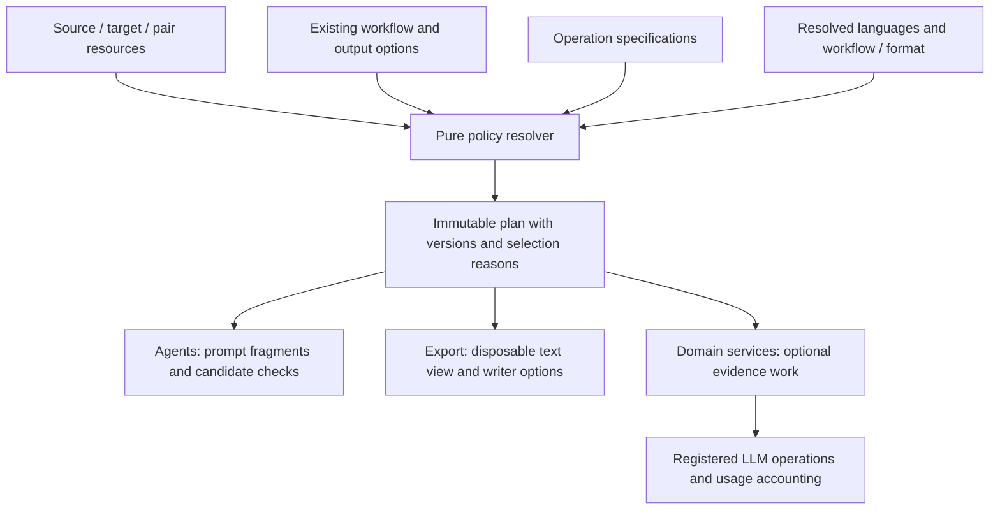

# Composable language policies and operation injection

[简体中文](../zh/design/language-policies.md) · [Architecture](../architecture.md)

Status: first edition, steps 1–3 implemented; step 4 revised to source-only developer definitions · 2026-10-01. Step 5 remains future work. The sections below retain the design rationale; supported configuration and commands are documented in [configuration](../configuration.md#built-in-language-policies).

The implementation lives in `i18n/policy/`, with domain adapters in `assemble/policy.py`, `postprocess/export_text.py` and `pipeline/language_policies.py`. Built-in IDs are `prompt.language_rules`, `punctuation.zh_cn`, `docx.chinese_font`, `markup.japanese_ruby` and `export.language_metadata`. CLI and Web execution share the resolver; policy definitions are edited in source, with read-only CLI developer diagnostics. Changed semantic revisions refresh derived analysis automatically; exports resolve fingerprints against their actual snapshot. Candidate checks, kinship evidence, translation memory and third-party executable operations are not enabled by this edition.

## 1. Recommended approach

Language profiles select operations; a registry declares their contracts; the owning domain service executes them. Compile those choices into an immutable plan before the affected work begins. Adding another language should usually require a profile or language-pair rule. Adding genuinely new behavior requires a registered implementation and tests, but no new language branch in each workflow service.

Use a small set of typed extension points. Prompt fragments, candidate checks, export text transformations and writer options have different inputs and permissions. Do not expose a universal `hook(runtime, store)` or arbitrary Python import paths in YAML. The workflow still owns ordering between translation, polishing, alignment, review and publication.

The first implementation should consolidate existing behavior. Evidence-based kinship resolution, translation memory and stronger style analysis can later use the same selection mechanism, but each still needs its own domain implementation and quality evaluation.

## 2. Starting points in this repository

Paths in this table are relative to `packages/core/wenyi_core/`.

| Current owner | Current behavior | Proposed change |
| --- | --- | --- |
| `i18n/data/languages/`, `pairs/`, `prompts.py` | Source/target instructions, titles, punctuation guidance, reading rules and pair-specific honorifics are already resources | Retain those resources and their prompt order; add typed operation bindings |
| `pipeline/runtime.py::export_punctuation_enabled` and `assemble/export_view.py` | Both select Simplified Chinese punctuation normalization | Resolve that selection once for each export |
| `assemble/docx_styles.py::_target_output_font` | Selects the Chinese target font | Consume a resolved font policy; keep run/style application in the writer |
| `assemble/html_bilingual.py` | Keeps Japanese source ruby | Consume a source-markup policy; keep DOM handling in the markup/export domain |
| `assemble/about.py`, `assemble/writer_common.py::_epub_lang` | Select an about-page locale and export language tag | Read explicit metadata defaults from the target profile |
| `pipeline/translation_batch.py` | Returns batch results before the service saves formal targets | Future entry point for read-only candidate checks |
| `llm/operations.py`, `llm/registry.py` | Explicit immutable model-operation and provider registration | Reuse the registration pattern; retain these as the authority for model routing |

Source auto-detection, identical-language rejection, state-language validation and segment alignment checks remain workflow invariants. They are not optional language operations. Existing structural cleanup such as ruby-marker removal is not automatically reclassified as Japanese-only behavior.

## 3. Composition and ownership



Proposed additions:

```text
i18n/
  policy/
    models.py          # Typed profiles, bindings, contexts and immutable plans
    registry.py        # Explicit operation specifications; no pipeline imports
    resolver.py        # Inheritance, selection, conflicts, ordering and fingerprints
  data/languages/      # Existing prompt rules plus source/target operation bindings
  data/pairs/          # Explicit pair-specific overrides
postprocess/           # Pure implementations for export text operations
document_styles/       # Pure layout/style decisions
markup/                # Pure markup preservation and placement helpers
assemble/              # Writer adapters and export operation dispatch
agents/                # Model requests; receive only the relevant plan view
pipeline/              # Domain execution, checkpoints, locks and persistence
```

`i18n.policy` contains pure data and resolution logic. It must not import agents, pipeline, providers or a concrete writer. A domain adapter maps selected IDs to its implementations. Bootstrap validation checks that every registered operation has an implementation in its declared domain, and that any referenced LLM operation exists. The registry and bindings are immutable after startup; each run receives a separate plan.

## 4. Extension points and allowed effects

| Extension point | Input → output | Owning caller | Allowed effect |
| --- | --- | --- | --- |
| `prompt.compose` | Task ID, language rules and bounded evidence → ordered prompt fragments | Shared prompt renderer | Adds instructions/context at declared template slots; preserves JSON schema and source text |
| `candidate.validate` | Source/target candidate records with stable IDs → findings | Translation, polishing or review domain | Reports problems; never rewrites or persists targets |
| `export.text` | Complete logical-paragraph view → transformed text and boundary mapping | Export view | Changes a disposable target copy only |
| `export.source_markup` | Source markup capabilities → preservation options | HTML/EPUB adapter | Keeps required source markup without changing source identities or text |
| `export.style` | Output format and target profile → typed style options | DOCX/HTML/PDF adapter | Selects defaults; existing paragraph/run precedence remains in the writer |
| `export.metadata` | Target profile and available resources → language tag/about-page resource | Export adapter | Changes exported metadata only |

Version one implements the existing prompt and export behavior. `candidate.validate` is a later contract. Optional model-backed evidence preparation is a later **domain stage**, not a callback hidden inside `prompt.compose` or a deterministic text handler.

Extension points have explicit request/result types, rather than a shared mutable dictionary. For example:

```python
from dataclasses import dataclass


@dataclass(frozen=True)
class ExportTextInput:
    segment_ids: tuple[int, ...]
    targets: tuple[str | None, ...]
    continuations: tuple[bool, ...]


@dataclass(frozen=True)
class ExportTextResult:
    segment_ids: tuple[int, ...]
    targets: tuple[str | None, ...]
    logical_boundary_maps: tuple[tuple[int, ...], ...]
```

The actual implementation must additionally identify each logical paragraph's range explicitly. Inputs are detached views: handlers receive neither `Storage` nor a mutable `Chapter`. Result application, validation and event recording belong to the domain caller.

For text transformations:

- Preserve segment IDs, count, order and continuation boundaries. Preserve `None` as pending and `""` as a deliberately completed empty target.
- Work over complete logical paragraphs, then map results back to the original segment layout. Do not process the ends of split continuations independently.
- Compose validated monotonic boundary maps in execution order. Remap EPUB annotation positions and DOCX style ranges once from the formal target to the final exported text, including digest checks. Reuse the existing export-view behavior as the baseline.
- Prefer exact edit mappings; the current diff-based mapping can remain the tested fallback for the existing punctuation operation. New insertion/deletion algorithms must specify ambiguous boundary affinity rather than silently reusing guessed offsets.
- Repeated export starts from a fresh formal snapshot. Operations must be deterministic, and normalizers should be idempotent. Never cumulatively transform the previous export view.

## 5. Operation registration

An `OperationSpec` records the following; this is a language-policy specification, separate from an LLM `OperationSpec`.

| Field | Purpose |
| --- | --- |
| `id`, `implementation_version` | Stable operation identity and explicit behavior version |
| `point`, `contract_version` | One extension point and its typed input/output contract |
| `roles` | Whether source, target or pair rules may select it |
| `applicability` | Supported canonical language constraints, book/SRT paths, tasks, formats and backend capabilities |
| `options_schema` | Strict, operation-specific options; reject unknown fields |
| `requires`, `after`, `before` | Dependencies and same-point ordering constraints |
| `exclusive_group` | Prevent incompatible writers for one concern, such as competing punctuation normalizers |
| `failure_policy` | Declared behavior: stop, or emit a finding and retain the unchanged input |
| `llm_operations` | Referenced model-operation IDs, empty for deterministic operations |

Existing behaviors become registrations such as `punctuation.zh_cn`, `docx.chinese_font` and `markup.japanese_ruby`. The selected handler still contains its algorithm; callers no longer contain `if target == "zh"` to choose it.

Do not make registration order an execution order. After selection, validate required dependencies, reject cycles, and use a stable topological sort. Independent operations use their ID as a tie-breaker. `after`/`before` constrain an edge only when both operations are selected; `requires` is mandatory and cannot silently enable a disabled operation. Reject cross-point ordering edges: phase ordering belongs to the workflow. Detect conflicting output fields or exclusive groups before execution rather than silently letting the last handler win.

## 6. Profiles, inheritance and overrides

Keep source and target bindings separate. Japanese source markup should not be selected merely because the translation target is Japanese. A profile fragment could look like:

```json
{
  "policy": {
    "source": {},
    "target": {
      "punctuation.zh_cn": { "mode": "auto" },
      "docx.chinese_font": { "mode": "auto" }
    },
    "export": {
      "language_tag": "zh-Hans",
      "about_locale": "zh"
    }
  }
}
```

For `zh-Hant`, explicitly disable inherited `punctuation.zh_cn`, set `language_tag` to `zh-Hant`, and preserve the current English about-page fallback during the behavior-preserving migration. Traditional Chinese punctuation normalization requires a separately tested handler; inheriting prompt vocabulary must not imply inheriting Simplified Chinese text transformation. Improving about-page localization is a separate behavior change.

Resolve choices in this order:

1. Normalize registered aliases, preserving script/region variants. Resolve profile inheritance root-to-leaf and reject cycles or missing parents.
2. Load common defaults, then the source-role and target-role profile bindings. These are separate namespaces, not an implicit “target wins over source” rule. Duplicate bindings with identical values may coalesce; conflicting cross-role bindings require an explicit pair/developer binding.
3. Apply an **exact registered pair** override, such as `ja__zh`. Version one does not infer `ja__zh-Hant` rules from `ja__zh`, or invent wildcard pair matching. A pair may explicitly reuse another rule resource when that is appropriate.
4. Apply validated developer operation bindings. Source/target/pair selection provenance remains in the result.
5. Apply workflow and format availability and existing feature gates. Resolve exclusive groups, dependencies and order; produce the final immutable plan.

Use maps keyed by operation ID, not list concatenation. A child replaces one binding in full; omitted bindings inherit, and `mode: off` removes one inherited selection. Scalar export defaults override individually. Missing values inherit; `null` is rejected unless the field explicitly accepts it. Do not reuse the current shallow `dict.update()` to merge these richer profiles.

Modes have precise meaning:

- `auto`: select when the effective profile and applicability conditions allow it; otherwise record a skip reason.
- `off`: disable an optional operation explicitly.
- `on`: request the operation, but fail validation if its language, format, dependencies or existing feature gate make it unavailable. It does not bypass prerequisites or turn on a paid parent workflow.

Mandatory alignment, stable IDs, lock ownership and publication rules cannot be turned off through policy overrides. Independent source/target/pair resources may add guidance, but cannot override those core invariants.

## 7. Concrete resolved plans

Assume existing output options are enabled unless noted.

| Input and operation | Selected behavior |
| --- | --- |
| Japanese → Simplified Chinese, bilingual EPUB | Japanese source guidance, Chinese target guidance, exact pair honorific rules; retain source ruby; normalize exported Chinese target text |
| English → Traditional Chinese, EPUB | English source guidance, Traditional Chinese instructions; **no** Simplified Chinese normalizer |
| Vietnamese → English, DOCX | Vietnamese/English guidance; no forced Chinese font or Chinese punctuation |
| English → Simplified Chinese, DOCX, punctuation option off | Chinese font policy for actual target text; punctuation operation skipped |
| Japanese → English, SRT | Subtitle-specific prompt rules and registered subtitle operations; no book prescan, glossary, polishing, review or EPUB markup operations |
| BabelDOC PDF export | Resolve supported text/metadata operations for the bridge path; do not schedule HTML/DOCX layout operations or import the AGPL service |

The resolver must use the actual export format and backend after default-format selection. It cannot guess the future export format from the input file. Compile translation and export plans separately, while keeping their shared language identity explicit. Source fallback text and the original side of bilingual output must not receive target-font or target-punctuation transformations.

## 8. Injecting a genuinely new model operation

For example, English → Chinese kinship evidence may eventually need more than a prompt sentence. Integrate it as follows:

1. Add an evidence domain service/agent and register a model operation such as `evidence.kinship` in `llm/operations.py`, with its default tier, workflow reachability, protocol version and budget semantics.
2. Declare a language-policy operation that requires that model operation, with an explicit book-only preparation stage and typed evidence output. Keep it opt-in until evaluated.
3. The preparation service executes selected evidence work after source-language detection and before consuming it in translation. It owns source-referenced artifact checkpoints and interruption recovery.
4. `prompt.compose` consumes bounded, validated evidence by stable reference. `candidate.validate` or Review may report unsupported specificity. Neither may silently rewrite an existing target or turn an uncertain relationship into a fact.
5. Actual changes to saved translations continue through explicit editing or the existing Review Autofix publication service.

Model policy selection must feed the same route preview, credential validation and budget planning used for execution. Extend `configured_operations`/workflow reachability to include the selected plan's declared model operations; do not add an independent provider factory. With `source: auto`, validate the detection path first and validate newly selected model routes immediately after detection, before their first call. Retry, concurrency, cancellation and once-only usage stay in the existing LLM/domain infrastructure.

Translation memory, kinship evidence and style analysis remain independently testable domain services. The language plan decides applicability; it does not implement their algorithms. The P06/P08/P09 proposals are not prerequisites for the first migration.

## 9. Built-in policy definitions and observability

Users retain the existing source/target, output, honorific and workflow options. Language-operation bindings and their options are developer-maintained source resources under `i18n/data/languages/` and `pairs/`; operation specifications live in `i18n/policy/registry.py`, with execution in the owning domain adapters. No YAML override or revision-acceptance field is exposed, and the API/Web settings do not provide a policy preview.

The read-only `wenyi language-policy` developer command uses the execution resolver and reports operation IDs, extension points, versions, options, origins, selection reasons, required model routes and fingerprints. Invalid source definitions fail before model calls or export writes. Existing `output.punctuation_normalize`, `honorific.strategy` and pipeline flags remain authoritative inputs.

Record a compact `language_policy_resolved` event at a run/export boundary. Log operation failures and material findings; avoid one configuration event per paragraph or logging source text as policy diagnostics. Third-party executable plugins, runtime hot reload and UI-uploaded Python remain outside this design.

## 10. Snapshots, resume and cache identity

Freeze a plan per invocation and use the same semantic view for translation, polish, review and fixing within that invocation. Do not re-read mutable configuration every batch. Compile a new export plan against the consistent export snapshot and requested format.

Persist immutable plan artifacts through `Storage`, for example `language-policies/<fingerprint>.json`. Both FileStorage and PostgreSQL use that logical key; do not create Web JSON files in `DATA_DIR`. Store resolved options, resource references/content hashes, operation/contract versions, order and provenance. Callable objects are never serialized.

For initialization, save the analysis's plan artifact and derived analysis metadata **before** the final manifest commit. Later invocation artifacts and events do not require adding segment history or modifying the manifest from Review. Record the plan reference with each relevant derived artifact/checkpoint and the invocation event. Already saved formal targets are not rewritten just because policy changed.

Use separate effective fingerprints:

| Fingerprint | Inputs and invalidation |
| --- | --- |
| Analysis/evidence | Source identity, consumed language rules, selected analysis/evidence operation versions/options; invalidate only affected derived data |
| Translation | Selected prompt templates/fragments and semantic operations, plus their versions/options and consumed evidence identities |
| Review | Review policy/templates, source and formal-target snapshot, glossary and model inference identity; mismatches forbid resuming an old conversation |
| Export | Export operations/options/order, selected assets, actual format/backend and source snapshot; never invalidate paid translation just for a font change |

Hash canonical resolved content, not every language file, timestamps or human-readable selection reasons. Existing model/content/glossary identities remain part of cache keys. A change to unused language resources must not invalidate this run. Handler versions must be bumped for behavior changes; pinning a resource snapshot alone cannot reproduce removed Python code.

On resume, verify required implementation versions and compare phase fingerprints. Matching plans reuse checkpoints. A changed translation policy applies only to pending work using the current built-in definitions; completed targets remain as they are, and affected analysis/evidence must be rebuilt before use. A changed review policy creates a new review session. Changed export options may create a fresh export directly. If a referenced implementation is unavailable, fail with an actionable explanation instead of silently using its newest version.

This does not require maintaining old language branches as compatibility code. Old artifacts without policy identities are not assumed equivalent to a new policy: derived analysis must be rebuilt automatically, with no retranslation of saved targets. A preview must distinguish free export changes from changes that require new model calls.

## 11. Implementation sequence and acceptance

Each step should be independently reviewable and keep CLI and Web behavior aligned.

| Step | Deliverable | Exit condition |
| --- | --- | --- |
| 1. Pure policy core | Typed profiles/specifications, explicit registry, deterministic resolver and plan preview | Alias/inheritance/conflict/order tests; no model calls or storage dependency |
| 2. Existing export policies | Migrate punctuation, font, ruby preservation, language tags and about-page selection | Equivalent existing output; remove duplicated language selection branches; offset/identity regressions pass |
| 3. Prompt integration and identity | Feed existing resource slots from resolved plans; store phase fingerprints via Storage | No unintended prompt-content/order changes; consistent CLI/Web snapshots; resume/cache tests pass |
| 4. Developer definitions | Source-only bindings and read-only CLI diagnostics; no YAML/API/Web policy settings | Diagnostics and execution agree; invalid definitions fail early; ordinary defaults unchanged |
| 5. Optional semantic extensions | Candidate findings first, then separately scoped model-backed evidence services | Explicit operation routing, checkpoints, budgets and quality evaluation for each feature |

Step 2 may use an invocation-local export plan without persistent semantic policy state; persistent plans arrive before any new semantic operation or policy override is enabled. Do not publish a half-enabled feature that accepts configuration but silently ignores it.

Verification should include:

- Resolver: canonical aliases, exact pair rules, root-to-leaf inheritance, explicit removal, cross-role conflicts, required disabled dependencies, cycles, unsupported formats and deterministic ordering.
- Export: `zh` versus `zh-Hant`, Japanese source versus Japanese target ruby, English/Vietnamese output, DOCX source-side font preservation, monolingual/bilingual output, explicit/default output paths and backend selection.
- State: `None` versus `""`, continuation reconstruction, unchanged formal targets, repeated exports, annotation/style boundary remapping, parallel exports from consistent snapshots and handler failure without partial publication.
- Resume/cache: a crash before manifest, after a batch save, during evidence work and during review; unchanged plans reuse results, changed relevant plans invalidate them, unrelated language/font changes do not trigger paid work. Check both file and PostgreSQL adapters.
- Integration: existing `test_i18n.py`, `test_translation*.py`, `test_bilingual.py`, `test_docx.py`, `test_assemble.py`, architecture/orchestrator contracts and storage tests, plus new resolver tests and the relevant CLI/API/Web cases. Use FakeClient and temporary data.

The behavior-preserving migration needs output/prompt comparisons, not a new paid translation campaign. New semantic guidance, kinship inference or memory reuse requires separate public-domain quality evaluation under CONTRIBUTING; offline tests do not establish literary quality. Keep new semantic operations opt-in until that work is complete.

## 12. First-edition verification

On 2026-10-01, 450 rendered prompt cases matched `main` at `4a42e3e97`: all 30 packaged templates, five language directions and three honorific strategies. This is an exact content/order comparison using public synthetic inputs, without model calls. Existing export regressions and new tests cover split-paragraph punctuation, pending/empty targets, immutable formal chapters, handler failure, export snapshot identity and source replacement before publication.

The complete offline Python suite, including isolated PostgreSQL/Redis services, passed 1,152 tests and 73 subtests. Three real-font PDF tests skipped because `fpdf2` was unavailable. All 88 browser regressions against current container assets (with test API interception), Web typecheck/build, Python source and new-test typechecks, Ruff and diff checks passed. Core/CLI/API sdist and wheel builds, all 55 bundled language resources and a clean default CLI/Core installation were verified; installed subtitle translation, plan persistence and resume also passed. File/PostgreSQL policy refresh, interrupted analysis rebuilds and once-only usage have regression coverage. Final review also covers strict profile/pair validation, target refinements of common defaults and rejecting invalid chapter selection before paid analysis. No new literary quality claim or paid semantic extension is part of this edition.

Policy definitions now remain source-only. MCP checks against the current containers confirmed global/project configuration reads and validation return 200, language documents contain only source/target, and policy previews are absent. A temporary TXT project uploaded and parsed successfully, then was deleted with existing projects retained. Book pages and WebSockets worked; real paid translation, Review and new exports were not executed.
