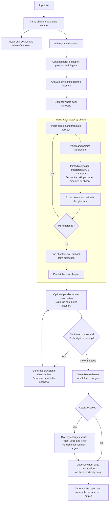
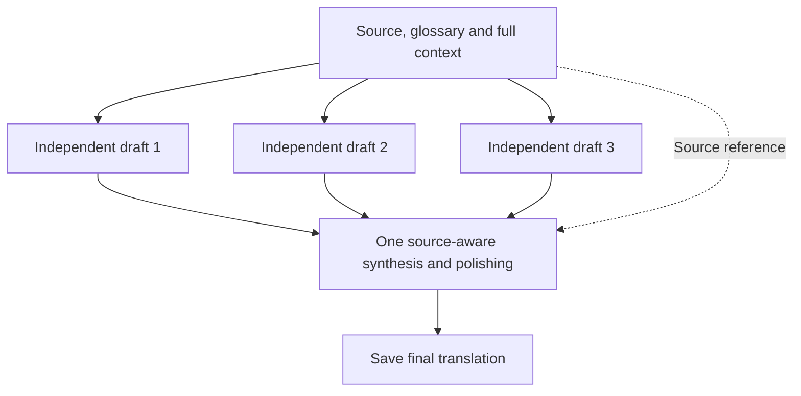

# Translation pipeline

[简体中文](zh/pipeline.md)

Wenyi first builds a whole-book understanding and then translates chapters in order. Optional stages can be disabled in `config.yaml` to reduce cost or runtime.

Source parsing is a separate, model-free stage. `wenyi parse` and the Web/Desktop upload task save a content- and configuration-bound source snapshot before AI preparation. The UI can show its table of contents and original paragraphs read-only immediately after parsing, including while preparation runs or after it fails. Parsing does not commit an initialized manifest, expose partially staged targets, or enable translation editing. Matching source snapshots survive initialization retries; changed source identities are not reused.



When `book_understanding` is enabled, chapter digests are generated in parallel before style analysis; the whole-book synopsis follows style analysis. Style analysis still reads the existing source samples. The initialization manifest commits last, after chapter digests and style analysis: initialized runs reuse saved results, while interrupted initialization rebuilds staged state on retry. Disabling `book_understanding` skips both chapter digests and the book synopsis. During translation, each batch receives the most recent glossary snapshot and translated context, keeping pronouns, terms, and tone consistent across chapters.

With `book_understanding` enabled, every chapter containing source text must have a usable digest before body translation starts. Truncated summary responses are retried by the shared provider retry policy, respecting `max_retries`, cancellation and invocation budgets. If a chapter digest still fails, preparation stops with the affected chapter indices. In initialized runs, successful digests and request usage remain saved for the next prepare/translate run. Empty chapters do not need digests. A failure to synthesize the whole-book synopsis logs a warning and allows translation to continue using the chapter digests. A failed group in a long book's synopsis merge invalidates the entire synopsis rather than omitting that group's chapters.

Both `synopsis.chapter` and `synopsis.book` use a default output limit of 8192 tokens. Explicit model `max_output_tokens` settings take precedence. This adds headroom for thinking tokens without changing the requested digest or synopsis length; it reduces truncation risk but can increase reasoning-token costs. Completed new digests record a completion marker. Legacy digests with unfinished endings are regenerated, and legacy book synopses without verified cache metadata are regenerated once. New book synopsis caches are reused only while chapter indices, digests, style guidance and language choices match their saved input fingerprint. Failed regeneration preserves existing analysis but does not inject a stale synopsis into translation.

The Review Fixer receives the same style brief, book synopsis, chapter digest,
relevant glossary subset, and nearby source/translation context used to preserve
the book's voice. Its normal Review-loop replacements remain temporary; the
optional Autofix publisher can later reuse it to produce formal segment targets.

## Language rules and state scope

Source and target are independent choices. Body translation, titles, term renderings and notes, analysis descriptions, polishing, chapter digests, and book synopses are requested in the target language. Character references in prose use target-language names; `source` and `aliases` retain their original spelling. Task instructions use English and live in `packages/core/wenyi_core/i18n/data/tasks/`; source understanding, target expression, pair-specific honorific rules, and metadata language constraints live alongside them in `languages/`, `pairs/`, and `shared/`. JSON keys and stable identities remain unchanged. Glossary type/gender values use English identifiers; older Chinese enum values are no longer converted. Analysis also accepts a model's list of style-guide bullets without discarding it. Matching policies reuse saved analysis; changed built-in semantic revisions automatically rebuild affected analysis while retaining glossary notes.

A passage the source writes in another language, such as a lyric or quotation inserted into a book, is text to preserve rather than a name to render: every pass that writes or judges target text keeps that wording as the source writes it and adds the target-language translation in parentheses after it. Isolated proper nouns, brand names and labels that already stand in their own script stay unbracketed. The rule is shared guidance, so it reaches translation, polishing, both Review stages, precision generation and the optional quality passes while the subtitle path keeps its own conventions. Existing completed targets are not rewritten by this rule; it applies to work translated under the updated built-in revision.

All targets, including `zh`, own separate state under `state/<book>/targets/<target-language>/`. Each invocation freezes separate analysis, translation and Review plans using only the consumed templates and rules. Immutable `language-policies/<fingerprint>.json` artifacts and a phase checkpoint are persisted through Storage before initialization commits the manifest. Review cache identity includes its effective plan alongside model/content/glossary identities. Completed targets stay saved; changed built-in semantic plans or missing identities automatically rebuild affected analysis before pending model work. Task-specific fingerprints let unchanged chapter digests and style analysis reuse their caches. The optional quality and evaluation passes (self-revision, editorial notes, final polish, chapter self-check, back-translation and judging) render their prompts from the translation plan, so their templates and rules belong to its revision identity. Interrupted rebuilds resume without prematurely committing the new checkpoint. Export-only changes compile a fresh plan without invalidating paid translation. See [built-in language policies](configuration.md#built-in-language-policies).

The pure `i18n/policy/` resolver separates source and target bindings, exact pair bindings defined in source. Domain adapters execute the registered punctuation, DOCX font, Japanese source-ruby and metadata capabilities against the consistent export snapshot. Text normalization operates over a complete logical paragraph and maps it back to stable segment boundaries; annotation/style offsets are remapped once. A paragraph that still holds a pending or untranslated segment receives only the transformations that do not depend on quote pairing, so source punctuation cannot reach an exported copy while a pending target stays pending. Pending `None`, intentionally empty targets and untranslated source fallbacks keep their identities. The chapter reading view asks for the same operations and reports the result as a read-only `display_target`, which never replaces the stored `target` an edit saves. The complete export view is validated before opening the output, so a text-handler failure cannot replace an existing artifact. Manifest-last initialization, atomic writes, domain locks and Review/Autofix publication boundaries remain in place.

## Whole-book understanding and context

The prescan creates a digest for each chapter and a synopsis of the complete book. Each digest and the book synopsis use fixed markdown sections (`Plot`, `Characters`, `Foreshadowing`, `Address`, plus `Relationships` for the book synopsis). Results are stored with `source_digest_v` / `book_synopsis_v`; only version 2 or newer is reused, so older free-form digests regenerate on the next understanding pass without retranslating body text. For every translation batch, the prompt presents stable information first: style guidance, the whole-book synopsis, the current chapter digest, the full current glossary, any source-language notes referenced by the current segments, recent source-target pairs, the source text to translate, and one following source segment. Recent context therefore remains immediately adjacent to the new source passage. Each recent entry is rendered as `Source`/`Translation` lines when `rolling_context_with_source` is true (the default). Context files that stored only `recent_targets` still load and render as target-only history.

This lets early chapters benefit from knowledge of later events while helping adjacent batches preserve pronouns, forms of address, tone, and sentences that span multiple source segments.

The following segment is a quoted, read-only reference from the same chapter. It helps the translator recognize a sentence or dialogue that continues beyond the batch, including fragments split from a long paragraph, and avoid inventing an ending or forcing final punctuation. The reference is excluded from the numbered inputs and output count; its content must not be translated early or borrowed to complete the current paragraph. It is also supplied to polishing. At a chapter end there is no following reference; the workflow does not cross into the next chapter. This is built in and remains enabled when `rolling_context_segments` is zero, which disables only preceding translations.

Alignment retries retain the reference. Single-paragraph fallback uses that paragraph's immediate source neighbor, including an unchanged number or symbol. Resume recomputes the neighbor from source order after splitting completed and pending batches, preserving completed targets and stable segment identities. Lookahead is never added to the saved rolling translation context. It adds at most one source segment to each translation or polishing request, with no extra model call. This supplies continuity evidence; actual wording and sentence endings still depend on the model.

## Glossary

The initial analysis seeds the glossary. As translation proceeds, Wenyi extracts and updates people, places, organizations, terms, techniques, recurring expressions, and forms of address from completed source-and-target pairs. An entry records a rendering decision, so a source the batch renders exactly as written — the same characters in both languages, or a Latin label kept as-is — is not recorded; neither is a full sentence, which states rather than names something. A spelling variant that would take the same target joins that entry's aliases instead of adding a row. Every body-translation batch receives the full current glossary, including entries absent from the current chapter. Fresh Reviewer requests share the complete final glossary snapshot across chapters and workers. Entries retain insertion order, and new entries append at the end to preserve stable prompt prefixes. After extraction changes the glossary, translation refreshes its snapshot before the next pending batch; completed batches keep their saved targets. If interruption occurs after targets are saved but before extraction is checkpointed, resume completes extraction before translating the next batch. Checkpointed batches skip both translation and extraction.

The glossary owns character name mappings. The style brief retains source identities,
gender, and descriptive character notes, but does not repeat translated names from the
analysis snapshot, which may be stale after glossary edits. Free-form notes and style text
are preserved verbatim, so outdated names embedded in that prose still require manual review.
This reduces conflicting structured guidance without rewriting completed translations.

Glossary `reading` is Japanese source metadata, not a target-language transliteration.
Analysis and extraction prompts require copying only kana explicitly provided for the term
in the original, such as furigana or a reading explanation, and leaving the field empty
without that evidence.
Japanese-source projects retain this field regardless of the translation language.
Other source languages omit it from the model's output schema, structured glossary context,
and Review evidence responses, even when translating into Japanese. Unexpected readings
returned by the model are ignored for non-Japanese sources. Existing and manually edited
glossary readings remain stored; this change does not delete them or rewrite completed text.
Internal callers supplying preformatted Fixer glossary text remain responsible for its
contents; automatic filtering applies to structured entries.
The stricter prompts follow the usual language-policy cache invalidation rules.
Review reuse and unfinished best-of-three checkpoints also bind the glossary reading policy,
so older cached work may require fresh model calls; historical artifacts remain available.
This trades inferred reading coverage for less unsupported pronunciation guidance;
offline tests do not establish model quality.

This policy provides cross-chapter terminology context at the cost of larger prompts and potentially higher token usage. It does not guarantee provider prefix-cache hits or improved translation quality. Selective evidence queries and segment Fixer requests still use relevant terms. `pipeline.glossary_scope` has been removed; configuration containing that key is rejected and must be edited explicitly.

If analysis, glossary extraction, or historical term alignment returns a collection with an invalid type, Wenyi ignores that collection and logs a warning with the operation, field, and actual type. Arrays retain object members and log the number of discarded non-object members. Missing or null fields and valid empty arrays do not produce warnings. These diagnostics use the CLI/worker's standard Python logs, exclude source text and model response content, and help identify missing candidates without interrupting translation.

The glossary constrains later translation and supplies evidence to the final review, but it does not automatically rewrite every previously translated occurrence. Use `glossary list` and `glossary conflicts` to inspect entries, then combine Review results, reports, and manual decisions when necessary.

A term carries one of three states. `ok` is a settled mapping; a later proposal whose target differs is recorded as a conflict awaiting a human decision. `manual` is an operator's decision, produced by editing a term or by resolving a conflict, and it outranks every proposal: extraction discards the differing target instead of recording a conflict, and the term counts as always-on whenever its type is configured for that. `conflict` marks a term whose settled mapping is contested. Resolving a conflict therefore locks the term exactly like an explicit edit. Conflicts recorded against a locked term are moot — nothing re-raises them, so they are neither listed nor counted as a gate. Settling a conflict rewrites every rejected candidate out of the affected paragraphs, not only the previously established target, so choosing the established target still corrects the passages that were translated with the proposal. Once the whole book is translated and before Review runs, an arbiter settles the conflicts that are still open by judging how the book actually uses each term; it chooses between the established rendering and the recorded proposals, and a conflict it cannot separate stays open for a human. Decisions are recorded before any formal target changes, so an interrupted run finishes them without repeating the model call. In the same window, distinct source terms that share one target are judged as groups: each group is compared against sampled passages to decide whether the sources name one entity, and whether a source-side distinction the shared target no longer preserves still matters. That verdict is recorded in the term note for later passes and never rewrites a target, because splitting a rendering stays a translation decision; a group the passages cannot decide stays open for a human.

## Quality controls

- **Segment alignment:** the model must return a JSON array with the same number of items as the input. Wenyi retries mismatched batches and falls back to translating one segment at a time.
- **Polishing:** improves target-language fluency while preserving meaning and segment count. After a successful single-shot translation batch, polishing appends one more user turn to that same conversation (shared system/user prefix for cache hits) instead of opening a fresh dialogue; alignment fallback still uses a standalone polish call.
- **Punctuation normalization:** optionally converts punctuation to common Simplified Chinese full-width conventions on an export-only copy for Simplified Chinese targets; other targets skip this conversion. It never rewrites formal chapter `target` values, so changing this output option does not alter translation, Review, or resume state.
- **EPUB annotation context:** during preparation, Wenyi resolves high-confidence footnote and endnote references to their source-language note bodies, deduplicates shared targets, and stores an auxiliary copy separately from chapter text. Translation batches automatically receive that copy only for the numbered segments that reference it. Backlinks, chapter jumps, external links, and other ordinary hyperlinks are excluded. The borrowed copy is never appended to the referencing segment or rolling context; note resources already present in the EPUB spine remain ordinary translatable book content.
- **EPUB annotation alignment:** removes recognized footnote markers from translatable source text while retaining semantic superscripts/subscripts. As soon as an annotated logical paragraph has been fully translated and polished, Wenyi makes one sequential alignment call against the formal target and immediately persists the restored `a/sup/href/id/class` positions. When export punctuation normalization is enabled, the export layer remaps those offsets together with the normalized in-memory copy. Split continuations are rejoined first; unrelated paragraphs make no call. Failures degrade to clickable end markers instead of dropping links. Untranslated text and bilingual source copies keep the source EPUB's original annotation positions. EPUB state created before this metadata format must be prepared again from the source book.
- **Agent Review:** starts only after every chapter has been translated and uses the completed glossary. Contiguous chapter chunks are checked concurrently with the existing Reviewer prompt. Every response must contain a completion receipt with the exact reviewed-segment count and `complete: true`; JSON object field order has no meaning. Strictly valid JSON proceeds directly to semantic validation. A repaired response is accepted only when the repair deterministically removes a JSON fence or adds/removes a root boundary delimiter without synthesizing payload content. Structurally ambiguous or truncated responses are rejected; an invalid receipt recursively splits only the affected chunk, and a singleton receives at most `1 + review_output_retries` attempts.
- **Selective evidence loop:** when a successfully reviewed leaf chunk contains candidates and `review_agent_loop` is enabled, a bounded Agent Loop confirms, dismisses, or refines them and may add issues within that chunk. It can request one glossary entry by source or alias, the first, middle, last, or Nth occurrence of a term, nearby source-and-translation segments, and limited book, chapter, or style context instead of loading the whole book or glossary into every prompt. The loop uses the configured tier (`strong` by default) and must decide after at most `review_agent_max_evidence_rounds` evidence rounds.
- **Cross-chunk arbitration:** after all concurrent chunks finish, contradictory consistency proposals for the same term, pronoun, or fixed expression can be sent through a final arbiter. The final suggestion set conservatively rewrites every losing proposal to the winning value; every superseded proposal remains available in the round traces. It never changes the glossary or translated text.
- **Shadow Fix and blind re-review:** confirmed issues for the same segment are grouped into one Fixer request. The Fixer receives the style brief, book synopsis, chapter digest, relevant glossary subset, and nearby source/translation pairs, and must return one complete replacement segment rather than a diff. All Fixers in a round read one immutable shadow snapshot; their patches are applied together only after the round finishes. The next whole-book Review and evidence index read the updated shadow text without receiving the old issue explanations. Unresolved arbitration conflicts and unverified Agent fallbacks are left unresolved. The loop stops after consecutive clean passes, the configured Fix limit, no progress, or an A→B→A cycle.
- **Optional Autofix publishing:** the Review engine itself remains read-only. When `review_autofix` is enabled, a separate publisher first overlays the folded `changes`, then sends final unresolved issues through the existing Review Agent Loop against that updated translation. Confirmed issues reuse the existing Fixer; no Autofix-specific loop or prompt exists. The publisher writes only final complete segments to formal `target` values, then refreshes annotation and DOCX style offsets.
Final review is the sole model-driven semantic review stage and is enabled by
default. Setting `pipeline.review: false` or passing `--no-review` skips it in the
one-command workflow. Review is also available as an independent stage:

```bash
uv run wenyi review book.epub
uv run wenyi review book.epub --autofix
```

The explicit command runs even when `pipeline.review` is disabled. Matching completed
results are reused; an unfinished Review resumes its saved rounds, chunks, and agent
traces when content, configuration, and glossary fingerprints match. Recoverable stops
such as Ctrl+C, timeouts, transport failures, HTTP 429/5xx, and provider balance/quota
errors (for example HTTP 402) leave the run as `interrupted`. Local/protocol failures
still finish as `failed` for diagnosis, but both `interrupted` and `failed` remain
resume-eligible so the next `review` continues the same directory instead of starting a
new one. Otherwise, a new whole-book Review starts. Cached chunks and completed initial screening skip model calls; pending Reviewer
requests use the same full glossary snapshot. Review reuse and resume compare the
full-glossary policy marker and every glossary field, including aliases, pronunciation,
gender, notes, and entry order. Any mismatch starts a new Review; caches created before
this policy are preserved but not reused. A finished shadow-fixer trace is also reused after an interrupted round commit when the round, segment, issue IDs and current-target hash still match; that completed revision is not requested or charged again. Resume also restores earlier rounds’ issue summaries and reconnects active patches to their history records, keeping final counts consistent with an uninterrupted run.
The run's configuration identity also includes the effective style brief, whole-book
synopsis, and chapter digests. Editing that guidance starts a new Review instead of
reusing completed results or old run-scoped fixer traces. Older caches without this
guidance identity remain available for inspection but are not reused. The revised
character guidance also advances the Review/Autofix Fixer request protocols, so a
subsequent run may require new model calls; previously completed translations are unchanged.
The CLI shows chapter loading and checkpoint preparation before reviewing paragraphs.
Elapsed time measures the entire current workflow and never resets at stage or round
boundaries. It continues advancing while model requests are pending, even after a stage
reaches its final count. Each invocation's duration is saved in the target's `timing.json`
and accumulated across resumes, excluding downtime. Paragraph counts advance when a top-level chunk
finishes, including chunks restored from cache.

The Review engine first updates a run-local shadow translation. Publishing is enabled by default;
set `pipeline.review_autofix: false` or pass `--no-autofix` to keep Review from
replacing formal chapter `target` values. The manifest and glossary are never changed.
The final result, run-local usage delta, events, and internal traces are written to:

```text
state/<book>/targets/<target-language>/reviews/review-YYYYMMDD-HHMMSS-ffffff/
```

The base Review directory contains `result.json`, `usage.json`, `events.jsonl`, and
`rounds/`.
`result.json` contains the final issues and folded modification suggestions;
chapter and segment indices point back to the formal chapter JSON instead of
copying source text and context. `rounds/` retains prompts, responses, patches,
and failures for diagnosis. Autofix adds `autofix/index.json`, which keeps each
before/after chain, issue ID, Agent decision, failure, target hash, and publication
status. Chapter JSON receives no additional Review history field. The journal is
written before formal targets and allows an interrupted publication to resume
idempotently. A partial final issue fix does not roll back a valid direct `change`;
the index and result summary report the failure. The run-local usage delta is also
merged exactly once into the book's cumulative `usage.json`, while `report.json`
stores a short Review/Autofix summary plus an `auto_qa` block (empty targets, open
glossary conflicts, residual deterministic findings, open review issues). Residual
findings are advisory and do not block export by default.
receives a compact Review/Autofix summary and sets `read_only: false` for a published
run.

`not_rereported` means only that a subsequent blind review did not report the
logical issue covered by the suggestion again. It is not proof that the proposed
replacement is semantically correct. Stop reasons include
`clean_confirmed`, `max_rounds`, `no_progress`, `cycle_detected`, and
`unresolved_fixes` (a previously confirmed issue did not receive a valid patch
even if a later Reviewer missed it).

## Best-of-three precision translation

The optional `best_of_three` mode processes each pending book batch through:
three independent initial drafts → one comprehensive source-aware polishing →
final text. Drafts share the frozen system/source/context prefix but have independent
conversation histories and do not see their siblings. The polishing call uses the
same prefix plus all three fallible drafts as data, combines their useful parts and
outputs the final text array directly, preserving the existing document structure.
Source, glossary, synopsis, recent context
and following source remain unchanged.



The synthesis policy prioritizes the source over draft consensus or fluency; it is
not an independently verified accuracy guarantee. There is no accuracy judge,
three-way polishing, blind acceptance, refinement round, per-paragraph competition
or scoped alignment recovery. Structural validation supports EPUB/DOCX backfill and
never silently zips away text. Draft and synthesis model-output failures share
`pipeline.align_retry_limit`: one initial request plus at most N retries (default N=2).
Malformed JSON, missing or invalid translation arrays/counts/types, forbidden blank
translations and truncated responses retry only the failing candidate or synthesis,
with unchanged messages, context and output limits. There is no automatic paragraph
splitting or single-paragraph fallback. Provider transport/credential failures and
storage/recording failures propagate without a nested provider retry loop.
Exhaustion pauses the batch; completed drafts and paid completed receipts remain
reusable, and manual resume gives missing stages a new bounded retry budget.
Each attempt retains its raw response, receipt and actual available usage; failed
receipts stay failed, without migration or revalidation of historical failures.
Segments that need no translation, such as numbers, punctuation, empty text and
whitespace-only text, are copied directly from the source in every draft and the
synthesis. Generated text at those positions is ignored, including changed spacing
or blank outputs; array count and string-type checks still apply.
Publication metadata means a structurally valid synthesized result, not a semantic
acceptance gate. `target_before_polish` stores the first initial draft as a comparison
reference, not a selected accurate draft; `target` stores the synthesized final text.

Initial drafts always use built-in three-branch concurrency. Web manual proofreading
can inspect published T1/T2/T3 and the original synthesis as read-only archives;
inspection does not make model calls or choose a draft for publication. Draft lookup
validates source and segment identity, hashes, and the saved T1 comparison. Unavailable
or ambiguous archives are reported rather than guessed.

Saved checkpoints allow an interrupted run with compatible source, context, policy
and model identities to resume without recreating completed draft work. Completed
formal targets are skipped, not reprocessed when the mode changes.

### Precision archive and future benchmark replay

New checkpoints separate immutable shared data from batch progress:

```text
precision/
  shared/
    objects/<hash>.json                 # Text, plans, terms, model metadata and result objects
    glossary/
      head.json                        # Current compact reference index, not formal glossary state
      versions/<hash>.json              # Base references or incremental changes, removals and order
  chapters/<chapter>/<start>-<count>/<fingerprint>/
    meta.json                          # Source identity and shared plan/glossary references
    drafts/T1.json, T2.json, T3.json     # Target and call references, not duplicate prose
    result.json                        # One synthesized result and first-draft references
    publication.json                   # Result reference, source hashes and ready/published state
    calls/<stage>/<attempt-id>.json     # Every new logical model invocation
```

Glossary versions retain full term metadata and historical prompt lines. Unchanged entries
are reused, while additions, updates, removals and ordering changes are recorded as deltas;
periodic reference-only bases bound replay depth. This does not change the formal glossary.
Shared request recipes reconstruct the exact historical system/user messages, including
their original formatting, without current prompts or the current glossary. Unknown
formatting is kept literally rather than approximated.

Call records retain request parameters, declared and available client-frozen model snapshots,
environment versions, elapsed model-call time, raw response and validated-output references.
Scoped provider events bind retries, fallbacks and known token/cache usage to that call, without
mixing concurrent drafts. Missing usage/model data remains explicitly unknown, not zero.
Failed or interrupted calls remain diagnostic records; cache reuse is not recorded as a new
model invocation. Response text is saved before local output validation.

This is a replay-data foundation, not a benchmark runner: restoring inputs is deterministic,
but another model invocation can differ because of sampling or server model revisions.
Credentials are excluded, and required external credentials must be supplied again. Private
source and translation text remain in the run's `Storage` artifacts, never automatically
exported or committed. Do not share this archive unintentionally.

Compatible old `inputs.json`/`synthesis.json`/`ready.json` checkpoints remain readable and are
not deleted or re-billed; legacy calls without historical request receipts are explicitly
marked incomplete for replay. New results are written only once. Published history is not
automatically pruned because it is useful for future comparison and replay.

Polishing is required. Whole-book Review remains a separate optional workflow,
and SRT is unchanged. A normal body batch uses four model calls
versus two for standard translation with polishing; structural retries add billed
attempts. Provider retries and other book tasks are accounted for separately;
this is **not a fixed 2× cost**. Precision uses the existing
`translation.body` and `polish.body` routes with the same profiles and provider
behavior as standard, without precision-specific output-token caps or hints.
Shared-prefix caching and concurrency
may reduce latency or input-token costs, but do not remove output costs. No real
model quality comparison has been performed yet; offline tests validate contracts,
not a guaranteed quality improvement.

## Resumability

Each completed translation batch is persisted immediately. When polishing is enabled, each segment in the chapter JSON keeps the translation-stage text in `target_before_polish` and the polished final text in `target`. Running `translate` again skips completed batches and fills only missing work. A standalone `assemble` briefly freezes the persisted manifest and chapter snapshot, releases the state lock, and renders from that snapshot, so it does not wait for a full translation running in another terminal.

On Windows, local JSON state reads/writes and artifact access use extended-length drive and UNC paths. Artifact keys remain relative to the run directory, and listings and resume operations retain portable `/`-separated keys. This does not guarantee arbitrarily long path support across all CLI operations or dependencies.

## Subtitle path (SRT)

`.srt` files take a parallel light path under `wenyi_core.srt`, not the book
Orchestrator above. There is no whole-book prescan, glossary, polishing, or
Review. Translation uses overlapping cue windows with high concurrency on the
strong model tier; progress is stored under `state/srt/<slug>/targets/<target-language>/` with
`cues.jsonl`, batch caches, `usage.json`, and `events.jsonl`. See
[Usage guide — SRT subtitles](usage.md#srt-subtitles).

## Model registration and usage

All model calls use stable operation IDs from `llm/operations.py`; `llm/registry.py` registers provider adapters. Runtime and the separate SRT workflow each own one routed client, reusing SDK connections and sharing invocation concurrency, quotas and usage. Agents select no provider or tier; Orchestrator retains only assembly and workflow routing.

To add a model operation, register an `OperationSpec` with its ID, default tier or inherited operation, output hint, workflow flags and protocol version, then call `complete(..., operation="domain.operation")` in the domain service. Validation, CLI previews and inference fingerprints read the same registry. To add a provider, implement its options, request builder, usage normalization and `ProviderAdapter` under `llm/providers/`, then register a `ProviderSpec`. Keep SDK initialization lazy and SDK retries disabled. Change the relevant protocol version when request semantics change, and cover requests, usage and resume behavior with offline tests. Registries are immutable after startup.

Review compares the effective inference identity of reachable operations. Model, endpoint or option changes create a new Review, while unrelated routes or concurrency changes preserve caches. Pending Autofix publication takes priority; evidence traces are never replayed under another model. Book and Review ledgers journal their snapshots in `usage-pending.json` before updating each `usage.json`, allowing idempotent recovery.
