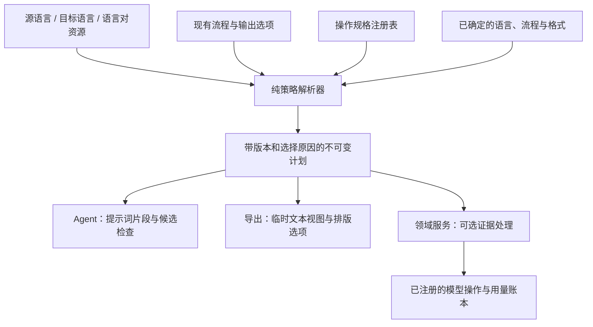

# 可组合的语言策略与操作注入

[English](../../design/language-policies.md) · [模块职责](../architecture.md)

状态：首版第 1–3 步已实施，第 4 步调整为仅源码维护的开发者定义 · 2026-10-01。第 5 步仍为后续工作。下文保留设计依据；当前支持的配置和命令见[配置说明](../configuration.md#内置语言策略)。

实现位于 `i18n/policy/`，领域适配位于 `assemble/policy.py`、`postprocess/export_text.py` 和 `pipeline/language_policies.py`。内置操作为 `prompt.language_rules`、`punctuation.zh_cn`、`docx.chinese_font`、`markup.japanese_ruby` 和 `export.language_metadata`。CLI 与 Web 执行共享解析器，策略定义仅通过源码维护，CLI 提供只读开发者诊断。语义修订变更自动刷新派生分析；导出指纹在实际导出时绑定一致快照。首版未启用候选译文检查、亲属关系证据、翻译记忆或第三方可执行操作。

## 1. 推荐方案

语言档案选择操作，注册表声明操作契约，由所属领域服务执行。在相关工作开始前，将选择结果编译成不可变的执行计划。新增语言通常只需要增加语言档案或语言对规则；新增算法需要注册实现并补充测试，但不必在各个流程服务中增加语言判断。

采用少量具有明确类型的扩展点。提示词片段、候选译文检查、导出文本变换和排版选项拥有不同的输入与权限，不提供通用的 `hook(runtime, store)`，也不允许 YAML 指定任意 Python 导入路径。翻译、润色、对齐、审校和发布之间的顺序仍由工作流负责。

首版先集中现有行为。亲属关系取证、翻译记忆、更稳健的风格分析以后可以复用这套选择机制，但仍需分别实现领域逻辑并评估质量。

## 2. 当前代码接入点

下表路径相对于 `packages/core/wenyi_core/`。

| 当前归属 | 当前行为 | 计划调整 |
| --- | --- | --- |
| `i18n/data/languages/`、`pairs/`、`prompts.py` | 源语言理解、目标表达、标题、标点提示、读音和语言对敬称规则已经资源化 | 保留资源与提示词顺序，增加有类型的操作绑定 |
| `pipeline/runtime.py::export_punctuation_enabled` 与 `assemble/export_view.py` | 两处选择简中标点规范化 | 每次导出只解析一次策略 |
| `assemble/docx_styles.py::_target_output_font` | 选择中文目标字体 | 读取已解析的字体策略，具体运行级样式应用仍由 Writer 负责 |
| `assemble/html_bilingual.py` | 保留日语原文 ruby 注音 | 读取原文标记策略，DOM 处理保留在标记/导出领域 |
| `assemble/about.py`、`assemble/writer_common.py::_epub_lang` | 选择说明页语言与导出语言标签 | 从目标语言档案读取明确的元数据默认值 |
| `pipeline/translation_batch.py` | 在服务保存正式译文前返回批次结果 | 后续接入只读的候选译文检查 |
| `llm/operations.py`、`llm/registry.py` | 显式、不可变的模型操作与提供商注册 | 复用注册方式，保留其模型路由权威入口 |

源语言自动检测、同语言拒绝、续跑语言校验、段落对齐检查仍是流程不变量，不作为可关闭的语言操作。已有的 ruby 标记清理等结构处理，也不能直接改成“只针对日语执行”。

## 3. 组合方式与职责



建议新增或扩展的位置：

```text
i18n/
  policy/
    models.py          # Typed profiles, bindings, contexts and immutable plans
    registry.py        # Explicit operation specifications; no pipeline imports
    resolver.py        # Inheritance, selection, conflicts, ordering and fingerprints
  data/languages/      # Existing prompt rules plus source/target operation bindings
  data/pairs/          # Explicit pair-specific overrides
postprocess/           # Pure implementations for export text operations
document_styles/       # Pure layout/style decisions
markup/                # Pure markup preservation and placement helpers
assemble/              # Writer adapters and export operation dispatch
agents/                # Model requests; receive only the relevant plan view
pipeline/              # Domain execution, checkpoints, locks and persistence
```

`i18n.policy` 只包含纯数据和解析逻辑，不导入 agents、pipeline、provider 或具体 Writer。领域适配器将选中的操作 ID 映射到本领域实现。启动校验确认每个注册操作都有对应实现，声明使用的模型操作也已注册。启动后注册表与绑定不再改变，每次运行获得独立计划。

## 4. 扩展点与允许的影响

| 扩展点 | 输入 → 输出 | 调用方 | 允许的影响 |
| --- | --- | --- | --- |
| `prompt.compose` | 任务 ID、语言规则、受限证据 → 有序提示词片段 | 统一提示词渲染器 | 在指定模板位置补充指令/上下文，保留 JSON 契约与原文 |
| `candidate.validate` | 带稳定 ID 的原文/候选译文 → 问题记录 | 翻译、润色或审校领域 | 报告问题，不改写、不持久化译文 |
| `export.text` | 完整逻辑段落视图 → 变换文本与边界映射 | 导出视图 | 只改变临时目标文本副本 |
| `export.source_markup` | 原文标记能力 → 保留选项 | HTML/EPUB 适配器 | 保留需要的原文标记，不改原文身份或文字 |
| `export.style` | 输出格式、目标语言档案 → 有类型的样式选项 | DOCX/HTML/PDF 适配器 | 选择默认样式，原有段落/运行级优先级仍由 Writer 决定 |
| `export.metadata` | 目标档案、可用资源 → 语言标签/说明页资源 | 导出适配器 | 只影响导出元数据 |

第一版接入现有提示词和导出行为，`candidate.validate` 是后续契约。可选的模型证据预处理属于之后增加的**领域阶段**，不能藏进 `prompt.compose` 或确定性文本处理器里执行。

每类扩展点定义自己的输入/输出类型，不共享可任意修改的大字典。例如：

```python
from dataclasses import dataclass


@dataclass(frozen=True)
class ExportTextInput:
    segment_ids: tuple[int, ...]
    targets: tuple[str | None, ...]
    continuations: tuple[bool, ...]


@dataclass(frozen=True)
class ExportTextResult:
    segment_ids: tuple[int, ...]
    targets: tuple[str | None, ...]
    logical_boundary_maps: tuple[tuple[int, ...], ...]
```

实际实现还需明确标识每个逻辑段落对应的片段范围。输入是独立视图，处理器拿不到 `Storage` 或可变 `Chapter`；结果应用、校验和事件记录由领域调用方负责。

文本变换遵守以下契约：

- 保留段落 ID、数量、顺序和续段边界；`None` 仍表示待翻译，`""` 仍可表示有意保存的空译文。
- 在完整逻辑段落上处理，再回填原始片段布局，不能独立处理被截断的续段末尾。
- 按执行顺序组合经过校验的单调边界映射。EPUB 注释位置和 DOCX 样式范围从正式译文到最终导出文本只回映一次，并检查摘要一致性，以当前导出视图为行为基线。
- 优先返回算法自身的精确编辑映射；现有基于 diff 的映射可作为现有标点操作经过测试的后备方式。新增插入/删除算法必须说明歧义边界归属，不能默默套用猜测位置。
- 每次导出从新的正式状态快照开始。操作必须确定，规范化操作应幂等，不能在上次导出视图上继续累计变换。

## 5. 操作注册

语言策略使用独立的 `OperationSpec`，不要与模型路由的同名规格混为一体。它需要声明：

| 字段 | 用途 |
| --- | --- |
| `id`、`implementation_version` | 稳定操作身份和明确的行为版本 |
| `point`、`contract_version` | 唯一扩展点及其输入/输出契约版本 |
| `roles` | 允许由源语言、目标语言还是语言对选择 |
| `applicability` | 支持的规范语言约束、书籍/SRT 路径、任务、格式与后端能力 |
| `options_schema` | 操作专属的严格参数模型，拒绝未知字段 |
| `requires`、`after`、`before` | 依赖与同一扩展点内的顺序约束 |
| `exclusive_group` | 阻止竞争同一职责的操作，例如两种互斥标点规范化 |
| `failure_policy` | 明确选择停止，或记录问题并保留未处理输入 |
| `llm_operations` | 引用的模型操作 ID；确定性操作为空 |

现有行为可以注册为 `punctuation.zh_cn`、`docx.chinese_font`、`markup.japanese_ruby` 等。处理器内部保留算法，调用方不再使用 `if target == "zh"` 选择执行哪个算法。

不能把注册顺序当作执行顺序。选择完成后检查必需依赖、拒绝循环，并使用稳定拓扑排序；独立操作按 ID 稳定排序。`after`/`before` 只在两端都被选中时约束顺序；`requires` 是硬依赖，不能偷偷启用源码定义禁用的操作。拒绝跨扩展点排序，阶段顺序由工作流决定。输出字段冲突和互斥组冲突必须在执行前报错，不能静默采用最后一个处理器。

## 6. 语言档案、继承和覆盖

源语言与目标语言绑定分开。不能因为目标是日语，就选中“保留日语原文注音”。简中档案可以增加如下片段：

```json
{
  "policy": {
    "source": {},
    "target": {
      "punctuation.zh_cn": { "mode": "auto" },
      "docx.chinese_font": { "mode": "auto" }
    },
    "export": {
      "language_tag": "zh-Hans",
      "about_locale": "zh"
    }
  }
}
```

`zh-Hant` 必须显式关闭继承来的 `punctuation.zh_cn`，设置 `language_tag: zh-Hant`；保持行为的首轮迁移继续使用当前英文说明页回退。繁中标点规范化要单独实现并测试，继承提示词词汇不能等于继承简中字符变换。完善说明页本地化另作行为改动。

解析顺序：

1. 规范化已注册别名，保留文字体系/地区变体；语言档案按祖先到子项展开，拒绝循环或缺失父项。
2. 加载通用默认值，再读取源语言角色和目标语言角色的绑定。二者是独立命名空间，不采用隐含的“目标覆盖源语言”。同 ID、同值可以合并；跨角色的冲突必须由明确的语言对或源码绑定裁定。
3. 应用**精确注册的语言对**覆盖，例如 `ja__zh`。首版不把 `ja__zh` 自动套给 `ja__zh-Hant`，也不引入通配语言对匹配。确实适用时，语言对可以明确复用另一个规则资源。
4. 应用经过校验的开发者操作绑定，保留每项选择来自哪里。
5. 根据流程、格式和已有功能开关筛选可用操作，再解决互斥、依赖与顺序，生成不可变计划。

操作集合按 ID 使用映射，不拼接列表。子项完整替换某个绑定；未写的绑定继承；`mode: off` 删除继承选择。导出标量默认值按字段覆盖。缺省表示继承，除非字段明确允许，否则拒绝 `null`。不能直接用当前浅层 `dict.update()` 合并这些更丰富的档案。

模式含义固定为：

- `auto`：有效档案与适用条件允许时启用，否则记录跳过原因。
- `off`：明确禁用可选操作。
- `on`：请求启用，但语言、格式、依赖或已有功能开关不满足时校验失败；不能绕过前提，也不能顺带开启付费的上层流程。

段落对齐、稳定身份、锁与发布边界不能通过策略关闭。源语言、目标语言和语言对可以追加指导，但不能覆盖这些内核约束。

## 7. 实际解析示例

以下假设相关已有输出选项已开启，另有说明除外。

| 输入与操作 | 选中的行为 |
| --- | --- |
| 日语 → 简中，双语 EPUB | 日语理解、中文表达、精确语言对敬称规则；保留原文 ruby；规范化导出副本中的中文译文标点 |
| 英语 → 繁中，EPUB | 英语理解与繁中表达；**不选中**简中标点规范化 |
| 越南语 → 英语，DOCX | 越英提示词规则；不强制中文字体或中文标点 |
| 英语 → 简中，DOCX，关闭标点选项 | 对实际译文应用中文字体策略；跳过标点操作 |
| 日语 → 英语，SRT | 字幕提示词与已注册字幕操作；不引入全书预扫、术语库、润色、Review 或 EPUB 标记处理 |
| BabelDOC PDF 导出 | 根据 HTTP bridge 路径选择支持的文本/元数据操作，不安排 HTML/DOCX 排版操作，不导入 AGPL 服务 |

解析器必须在默认导出格式确定后，使用实际输出格式和后端，不能从输入文件猜测以后要导出什么。翻译计划与导出计划分别编译，共享的语言身份则保持明确。原文回退文本与双语原文侧不能应用目标字体或目标标点变换。

## 8. 如何注入一个真正的新模型操作

以未来的“英译中亲属关系证据”举例：它可能需要的不只是一句提示词，应这样接入：

1. 新增证据领域服务/Agent，在 `llm/operations.py` 注册 `evidence.kinship` 这样的模型操作，声明默认档位、流程可达性、协议版本与预算语义。
2. 注册依赖它的语言策略操作，限定在书籍准备阶段，输出有类型的证据；完成评测前保持显式选用。
3. 准备服务在源语言检测后、翻译使用证据前执行被选中的证据工作，负责带原文引用的产物检查点与中断恢复。
4. `prompt.compose` 根据稳定引用读取经过校验、受预算约束的证据；`candidate.validate` 或 Review 可以报告无依据的细化，不能静默改写已有译文，也不能把不确定关系变成事实。
5. 已保存译文的实际修改仍经过明确编辑或现有 Review Autofix 发布服务。

模型策略选择必须进入实际执行使用的路由预览、凭据校验与预算规划。扩展 `configured_operations`/流程可达性，让它纳入计划声明的模型操作，不另建 provider 工厂。`source: auto` 时先校验语言检测路径，检测后立即校验新选中的模型路由，再开始调用。重试、并发、取消、用量只记一次仍由现有 LLM 和领域基础设施保证。

翻译记忆、亲属取证、风格分析仍是可独立测试的领域服务。语言计划决定何时适用，不负责实现这些算法。P06/P08/P09 不是首轮迁移的前置依赖。

## 9. 内置策略定义与可观察性

用户继续使用现有源/目标语言、输出、敬称与流程选项。语言操作绑定及参数由开发者在 `i18n/data/languages/`、`pairs/` 的源码资源中维护，操作规格位于 `i18n/policy/registry.py`，执行归属于领域适配器。不提供 YAML 操作覆盖或修订接受字段，API 与网页设置也不提供策略预览。

只读的开发者命令 `wenyi language-policy` 使用实际执行的解析器，显示操作 ID、扩展点、版本、参数、来源、选择原因、所需模型路由与指纹。非法源码定义在模型调用或导出写入前失败。已有 `output.punctuation_normalize`、`honorific.strategy` 与 pipeline 开关仍是权威输入。

运行或导出边界记录精简的 `language_policy_resolved` 事件，记录操作失败与重要发现；不逐段重复记录配置，也不将原文写入策略诊断日志。第三方可执行插件、运行中热重载与 UI 上传 Python 仍不在本设计内。

## 10. 快照、续跑与缓存身份

每次运行冻结一个计划，翻译、润色、审校和修订在该次运行内使用同一语义视图，不能每批重新读取可变配置。导出根据一致快照与实际请求格式编译独立计划。

通过 `Storage` 保存不可变计划，例如逻辑键 `language-policies/<fingerprint>.json`。FileStorage 和 PostgreSQL 使用同一逻辑键，Web 不在 `DATA_DIR` 另存 JSON。保存解析后的参数、资源引用/内容哈希、操作/契约版本、顺序和来源，不序列化函数对象。

初始化时，分析所用的计划产物及派生分析元数据必须在 manifest 最终提交**之前**写入。后续运行通过产物与事件记录计划，不需要新增章节历史，也不能由 Review 修改 manifest。相关派生产物/检查点及运行事件记录计划引用，策略变化本身不会改写已有正式译文。

有效指纹分开计算：

| 指纹 | 内容与失效范围 |
| --- | --- |
| 分析/证据 | 原文身份、实际使用的语言规则、分析/证据操作版本与参数；只失效相关派生数据 |
| 翻译 | 实际选中的模板/提示词片段、语义操作及其版本/参数、所用证据身份 |
| Review | 审校策略/模板、原文与正式译文快照、术语库和模型推理身份；不匹配时不能续用旧会话 |
| 导出 | 导出操作/参数/顺序、实际资源、格式/后端与源快照；字体变化不能让付费翻译失效 |

哈希规范化后的有效内容，不哈希整个语言目录、时间戳或供人阅读的选择原因。已有模型、内容与术语库身份仍属于缓存键。未使用语言资源的变化不能影响当前任务。处理器行为变化必须提升版本；只保存资源快照不能重现已经移除的 Python 实现。

续跑时检查实现版本并比较各阶段指纹。相同计划复用检查点；翻译策略改变后，自动使用当前内置定义处理待完成内容，已有 target 保持不变，受影响的分析/证据必须先重建。审校策略改变后开启新审校会话；导出参数变化可以直接形成新导出。所需实现版本不可用时给出明确错误，不能静默换成最新版。

不为此保留旧语言条件分支作为兼容层。没有策略身份的旧产物也不能被认作与新策略等价：复用前自动重建派生分析，不重译已保存 target。预览应区分不消耗模型的导出变更，以及会触发新模型调用的变更。

## 11. 实施顺序与验收

每一步独立可审查，CLI 与 Web 保持一致。

| 步骤 | 交付 | 完成条件 |
| --- | --- | --- |
| 1. 纯策略内核 | 类型化档案/规格、显式注册表、确定性解析器和计划预览 | 别名、继承、冲突、排序测试；不依赖模型调用或状态存储 |
| 2. 迁移现有导出策略 | 标点、字体、ruby 保留、语言标签、说明页选择 | 当前输出等价；删除重复的语言选择分支；偏移与身份回归通过 |
| 3. 接入提示词与身份 | 从计划填充现有提示词位置；通过 Storage 保存分阶段指纹 | 提示词内容/顺序无非预期变化；CLI/Web 快照一致；续跑与缓存测试通过 |
| 4. 开发者定义 | 仅源码维护的绑定与只读 CLI 诊断，不提供 YAML/API/Web 策略设置 | 诊断与执行一致；非法定义提前失败；普通默认行为不变 |
| 5. 可选语义扩展 | 先接候选问题报告，再单独实现模型证据服务 | 每项功能具备明确路由、检查点、预算和质量评测 |

步骤 2 可以只使用当前调用内的导出计划，不要求立即持久化语义策略状态；在启用新语义操作或策略覆盖之前，必须先完成计划持久化。不能发布接受配置但静默忽略的半成品功能。

验证范围：

- 解析器：别名、精确语言对、祖先到子项继承、显式删除、跨角色冲突、依赖被禁用、循环、不支持的格式与稳定排序。
- 导出：`zh`/`zh-Hant` 区分、日语是源或目标时 ruby 的区别、英语/越南语输出、DOCX 原文侧字体保留、单双语、显式/默认路径与后端选择。
- 状态：`None`/`""` 区分、续段回并、正式 target 不变、重复导出、注释/样式边界回映、一致快照下并行导出、处理器失败不产生部分发布。
- 续跑/缓存：manifest 前、批次保存后、证据处理中、Review 中中断；同策略复用、相关策略变化失效、无关语言/字体变化不触发付费工作；文件与 PostgreSQL 后端都覆盖。
- 接入：复用 `test_i18n.py`、`test_translation*.py`、`test_bilingual.py`、`test_docx.py`、`test_assemble.py`、架构/Orchestrator 契约与存储测试，增加解析器测试和相关 CLI/API/Web 用例；使用 FakeClient 和临时数据。

保持行为的迁移需要输出/提示词对比，不需要重新进行付费长篇翻译。新增语义指导、亲属推断、翻译记忆复用时，按 CONTRIBUTING 单独开展公版文本质量评估；离线测试不能证明文学翻译质量，完成前这些语义操作保持显式选用。

## 12. 首版验证记录

2026-10-01，450 组渲染提示词与 `main` 的 `4a42e3e97` 完全一致，涵盖全部 30 个打包模板、5 组语言方向和 3 种敬称策略。对比使用公开的合成输入，逐项检查内容与顺序，未调用模型。已有导出回归与新增测试覆盖跨片段标点、待译／空译文、正式章节不变、处理器失败、导出快照身份及发布前原文件变化。

完整离线 Python 测试（含隔离 PostgreSQL/Redis）通过 1152 个测试及 73 个子测试；3 个真实字体 PDF 测试因缺少 `fpdf2` 跳过。当前容器资源上的全部 88 个浏览器回归（接口使用测试拦截）、前端类型检查与构建、Python 源码和新增测试的类型检查、Ruff 与差异检查通过。Core/CLI/API 的 sdist 和 wheel、55 个内置语言资源及干净环境的默认 CLI/Core 安装已验证，安装包的字幕翻译、计划持久化与续跑同样通过。文件／PostgreSQL 的策略刷新、分析重建中断与用量仅累计一次均有回归覆盖。最终检查还覆盖语言及语言对定义的严格校验、目标语言对通用默认值的细化，以及在付费分析前拒绝无效章节选择。首版不包含新的文学质量结论或付费语义扩展。

策略入口已按源码内置方式调整。当前容器经 MCP 实测：全局与项目配置读取、校验均返回 200，语言配置只含 source/target，网页无策略预览；临时 TXT 项目上传及解析成功，随后删除，保留原有项目。书籍页面与 WebSocket 正常；未执行真实付费翻译、Review 或新导出。
