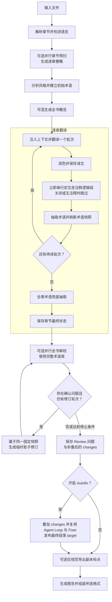
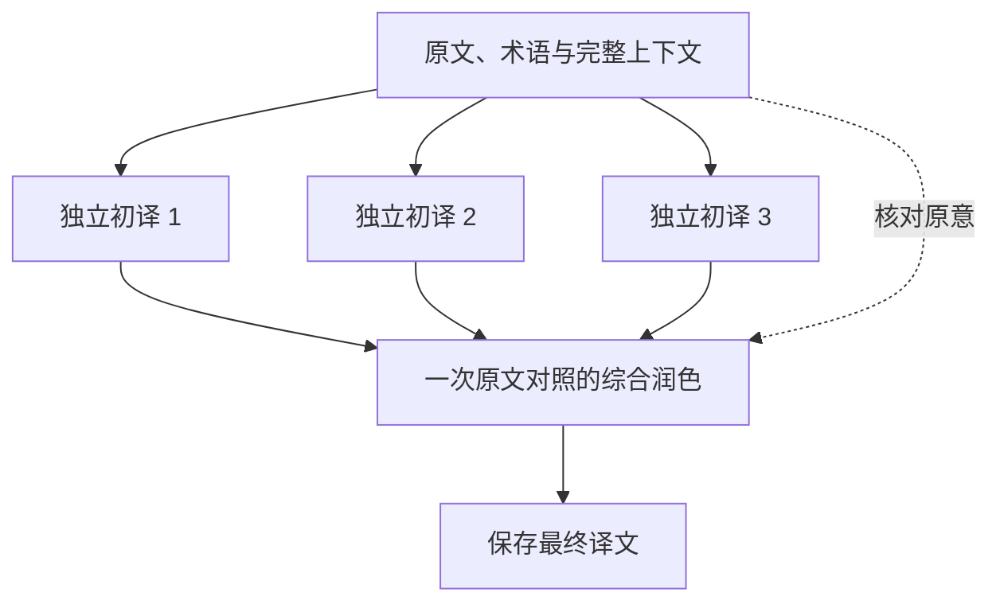

# 翻译流程

[English](../pipeline.md)

文译以“先建立全书理解，再按章稳定翻译”为默认策略。可以通过 `config.yaml` 关闭不需要的阶段，以降低成本或缩短时间。



启用 `book_understanding` 时，先按配置的并发数生成逐章梗概，再分析风格，最后生成全书概览。风格分析仍读取原有的原文样本。初始化 manifest 在章节梗概和风格分析完成后最后提交：已初始化的运行复用保存结果，初始化中断后重试则重建暂存状态。关闭 `book_understanding` 会跳过章节梗概和全书概览。翻译过程中，每批获得最新的术语快照和已译上下文，确保代词、术语和语气跨章一致。

开启 `book_understanding` 后，有原文内容的章节必须具备可用梗概，才能开始正文翻译。概要响应被截断时，由共享 provider 重试策略处理，遵守 `max_retries`、取消信号和本次运行预算。章节梗概仍生成失败时，准备阶段会明确提示失败章节索引并停止。已初始化的运行会保存成功的梗概和请求用量，供下次 prepare/translate 续跑复用。空章节不要求梗概。全书概览合成失败时记录警告，正文翻译继续使用章节梗概。长书分组合成时，任一分组失败都会使本次全书概览失败，不会丢掉该组章节后发布缺章概览。

`synopsis.chapter` 和 `synopsis.book` 的默认输出上限均为 8192 tokens；用户显式设置的模型 `max_output_tokens` 优先。这为 thinking tokens 留出更多空间，不改变提示词要求的梗概或概览长度；可降低截断风险，但可能增加推理 token 费用。新生成的完整章节梗概记录完成标记；旧梗概存在半句结尾时会重新生成，缺少有效缓存元数据的旧全书概览会重新生成一次。新全书概览仅在章节索引、梗概、风格指南和语言选择与保存的输入指纹一致时复用。重新生成失败会保留已有分析，但不会把失效概览注入本次翻译。

Review Fixer 同样会获得风格指南、全书概览、本章梗概、相关术语及邻近原译文，
以保持全书风格；普通 Review 循环中的替换只存在于影子译文中，可选 Autofix 发布
阶段会复用它生成正式段落 target。

## 语言规则与状态范围

源语言与目标语言独立选择，正文、标题、术语译名及备注、分析描述、润色、章节梗概和全书概览均明确要求使用目标语言。说明中的人物称呼使用目标语言姓名，`source` 和 `aliases` 保留原文拼写。任务指令统一使用英语，位于 `packages/core/wenyi_core/i18n/data/tasks/`；源语言理解、目标语言表达、语言对敬称差异及元数据语言约束集中在同目录下的 `languages/`、`pairs/`、`shared/`。JSON 键及稳定身份保持不变；术语类型/性别值使用英语标识符，不再转换旧中文枚举。分析接受模型返回的风格指南列表，避免丢弃内容。策略匹配时复用已有分析；内置语义修订变更后自动重建受影响的分析，保留术语备注。

所有目标（包括 `zh`）均使用 `state/<书名>/targets/<目标语言>/` 保存独立状态。每次运行分别冻结分析、翻译和 Review 计划，只绑定实际使用的模板与规则。不可变的 `language-policies/<指纹>.json` 产物与阶段检查点通过 Storage 持久化，初始化最后提交 manifest。Review 缓存在模型、正文和术语身份之外比较有效策略计划。已完成译文继续保留；内置语义计划变更或缺少身份时，会自动重建受影响的分析，再继续待完成模型工作。任务级指纹允许未变化的章节梗概和风格缓存复用；重建中断后可恢复，不提前提交新检查点。可选质量与评估步骤（自校、编辑意见、终润、章节自检、回译与评分）也从翻译计划取提示词，其模板与规则同属该计划的修订身份。仅导出变更会生成新导出计划，不使已付费翻译失效。见[内置语言策略](configuration.md#内置语言策略)。

纯 `i18n/policy/` 解析器区分源码定义的原文、目标与精确语言对绑定。领域适配器基于一致导出快照执行注册的标点、DOCX 字体、日语原文 ruby 和元数据能力。文本规范化处理完整逻辑段落后回映射到稳定片段边界，注释与样式偏移只重映射一次。待译 `None`、有意空译文和未翻译原文回退保留各自身份。打开输出文件前会验证完整导出视图，文本处理器失败不会替换已有产物。保持 manifest 最后提交、原子写入、领域锁及 Review/Autofix 发布边界。

## 全书理解与上下文

预扫会生成逐章梗概和全书概览。梗概与概览使用固定 markdown section（`Plot`、`Characters`、`Foreshadowing`、`Address`，全书概览另含 `Relationships`）。结果带 `source_digest_v` / `book_synopsis_v`；仅 `>= 2` 的版本会跳过重生成，旧自由文梗概会在下次预理解时重写，**不会**重翻正文。翻译每个批次时，提示词会按稳定信息优先的顺序提供角色风格、全书概览、章节梗概、当前全量术语表、当前段落引用的原文注释、最近源译对、待译原文和紧接其后的一条原文片段。前文因此仍与新一批待译正文紧邻。`rolling_context_with_source` 为真（默认）时，每条前文按 `Source`/`Translation` 成对渲染。仅含 `recent_targets` 的旧上下文文件仍可加载，并降级为仅译文。

这使早期章节可以参考后续剧情，同时让同章相邻批次在代词、称谓、语气和跨段句意上保持衔接。

后文取自同一章，单独引用为只读参考，帮助翻译识别跨批次的未完句、对话以及长段拆分形成的续段，避免提前收句或强行补上结束标点。它不计入编号输入与输出段数，不得提前翻译，也不得借用其中的信息补完当前段落。润色阶段同样会收到这条参考。章末没有后文时留空，不跨章取文。这是内置行为；`rolling_context_segments` 为零只关闭前文译文，不影响后文参考。

段数对齐重试保留参考；逐段兜底改为取该段真正的下一条原文，包括无需翻译的数字或符号。续跑在分开已完成与待译批次后，按原文顺序重新确定后文，保留已完成译文和片段身份。后文不会写入滚动译文上下文。每次翻译或润色请求最多增加一条原文片段，不新增模型调用。这只是补充衔接证据，实际措辞与收句效果仍取决于模型。

## 术语库

样章分析会建立初始术语库；翻译过程中会从已完成的源文和译文中抽取并更新人物、地名、组织、术语、招式和称谓。每个正文翻译批次都注入当前全量术语表，包括本章未出现的词条；新 Reviewer 请求跨章节、跨并发 worker 共享最终完整术语快照。词条保持插入顺序，新词条追加到末尾，以保持提示词前缀稳定。术语抽取改变词条后，在下一批待译正文开始前刷新快照；已完成批次保留已有译文。如果译文已保存而术语抽取检查点尚未写入，续跑先补齐抽取，再翻译下一批；已写入检查点的批次同时跳过翻译和抽取。

全量策略提供跨章术语上下文，同时增大提示词并可能增加 token 用量；它不保证 provider 前缀缓存命中或译文质量提升。选择性取证和单段 Fixer 请求仍使用相关术语。`pipeline.glossary_scope` 已移除，包含该键的配置会报错，需显式删除。

分析、术语抽取或历史术语对齐返回类型错误的集合字段时，会忽略该集合，并记录包含操作名、字段名和实际类型的警告。数组保留对象成员，同时记录被丢弃的非对象成员数量。缺省字段、null 和合法空数组不产生警告。这些诊断写入 CLI/worker 的标准 Python 日志，不包含原文或模型响应内容，方便定位候选信息缺失，同时避免中断翻译。

术语表用于约束后续翻译，并为最终审校提供证据，但它不能自动保证已经完成的历史译文全部回写一致。可通过 `glossary list` 和 `glossary conflicts` 检查条目与冲突，再结合 Review 结果、报告或人工调整。

## 质量控制

- **段数对齐**：模型必须返回与输入等长的 JSON 数组；失败会重试，仍失败时逐段兜底。
- **润色**：不改变原意和段落数量的前提下提升目标语言流畅度。批次翻译一次成功时，润色在同一对话中追加一轮 user（复用 system/翻译 user 前缀以提高缓存命中），不再新开对话；逐段兜底时仍使用独立润色请求。
- **标点规范化**：仅对简体中文目标可选地在一次性导出副本中统一为简体中文大陆常用全角标点；其它目标跳过。它不会改写正式章节 `target`，切换该输出选项不影响翻译、Review 或续跑状态。
- **EPUB 注释上下文**：准备阶段会把高置信脚注、尾注引用解析到其原语言注释正文，对共享目标去重，并将辅助副本与章节正文分开保存。翻译批次只会把该副本关联给实际引用它的编号段落；回链、章节跳转、外部链接和其它普通超链接不会注入。借用的副本不会拼进引用段原文或滚动上下文；原本就在 EPUB spine 中的注释资源仍作为书内普通正文翻译。
- **EPUB 注释定位**：解析时从待译源文中移除已识别的脚注号，同时保留具有正文含义的上下标；每个含注释的逻辑段完成翻译和润色后，立即针对正式译文串行调用一次模型并落盘原始 `a/sup/href/id/class` 的定位结果。若开启导出标点规范化，导出层会在规范化内存副本的同时重映射这些偏移。超长续段会先重新合并，无关段落不产生调用。定位过程不得改动译文；失败时降级为段末可点击标记，不会静默丢链接。未翻译原文和双语版原文侧直接保留源 EPUB 中的注释位置。该元数据格式引入前创建的 EPUB 状态需从源书重新准备。

- **Agent Review**：全部章节翻译完成后才开始，并使用最终术语库。章节按连续文本块并发执行原有 Reviewer 提示词。每次响应都必须包含“实际审校段数 + `complete: true`”完成回执；JSON 对象字段顺序没有语义。严格合法的 JSON 会直接进入语义校验。经过修复的响应只有在修复可确定地移除 JSON 代码围栏，或仅增删根边界分隔符而不补造 payload 内容时才会接受；结构有歧义或遭截断的响应会被拒绝。无效回执只会递归拆分受影响的审校块，单段最多尝试 `1 + review_output_retries` 次。
- **选择性取证循环**：成功完成初审的叶块若产生候选问题，且开启 `review_agent_loop`，有界 Agent Loop 会确认、驳回或细化候选，也可补充当前块内的问题。它能按原文或别名读取单个术语条目，按首次、中间、末次或第 N 次请求术语命中，获取指定段落的相邻原译文，以及有限的全书概览、章节梗概和风格信息，无需给每个请求注入整本书或全量术语表。循环默认使用 `strong` 档，并必须在最多 `review_agent_max_evidence_rounds` 轮取证后给出结论。
- **跨块仲裁**：所有并发块完成后，同一术语、人称或固定表达若出现互相矛盾的一致性建议，可再交给终局仲裁器。最终建议集会保守地把所有落选建议统一改写为胜出值；所有被替代的旧建议仍保留在逐轮记录中，不会修改术语库或正文。
- **影子修订与盲复审**：同一段的多个确认问题会合并为一次 Fixer 请求。Fixer 会获得风格指南、全书概览、本章梗概、相关术语及邻近原译文，并必须返回完整单段替换而非局部 diff。同轮所有 Fixer 读取同一份不可变影子快照，全部结束后才统一应用；下一轮全书 Reviewer 与取证索引只读取更新后的影子译文，不接收旧问题说明。未解决的仲裁冲突和未经确认的 Agent fallback 会保留为未解决项。连续无问题、达到 Fix 上限、没有有效进展或检测到 A→B→A 循环时停止。
- **可选 Autofix 发布**：Review 引擎自身仍保持只读。开启 `review_autofix` 后，独立发布服务会先叠加折叠后的 `changes`，再让最终未解决 issues 基于更新后的译文进入现有 Review Agent Loop；确认项继续复用现有 Fixer，不存在 Autofix 专属 loop 或 prompt。发布阶段只把最终完整段落写入正式 `target`，随后刷新注释与 DOCX 样式偏移。
最终审校是唯一由模型执行的语义审校阶段，默认开启。设置
`pipeline.review: false` 或传入 `--no-review` 可在一键流程中跳过；也可以将它
作为独立阶段使用：

```bash
uv run wenyi review book.epub
uv run wenyi review book.epub --autofix
```

即使关闭 `pipeline.review`，显式调用上述命令仍会执行审校。内容、配置与术语库指纹匹配时，
复用已完成的结果，或从未完成的轮次、审校块与 Agent 记录续跑。Ctrl+C、超时、传输失败、
HTTP 429/5xx，以及余额/配额类错误（如 HTTP 402）会将运行标为 `interrupted`；本地/协议
失败仍记为 `failed` 便于诊断，但 `interrupted` 与 `failed` 都可续跑，下次 `review`
继续同一目录而不是新建。指纹不匹配时重新开始全书审校。命中审校块缓存或已完成初审记录时跳过模型调用；待处理 Reviewer 请求使用同一份全量术语快照。
Review 缓存复用与续跑会比较全量策略标记、所有术语字段（包括别名、读音、性别、备注）及词条顺序。
任一项不匹配便新建 Review；旧策略产生的缓存保留，但不再复用。
CLI 在段落审校前显示章节加载和检查点准备阶段。
耗时显示本次工作流的总运行时间，切换阶段或轮次不会归零；等待模型响应时继续走动，
即使当前阶段已达到最终计数也不会停止。每次运行用时保存到目标目录的 `timing.json`，
续跑时累计，不计入两次运行之间的停机时间。段落计数在顶层审校块
完成时推进，也包括从缓存恢复的块。

Review 引擎先更新本次运行内存中的影子译文；发布默认开启，设置
`pipeline.review_autofix: false` 或传入 `--no-autofix` 后，不会覆盖正式章节
的 `target`。manifest 和术语库始终不变。最终结果、本次用量、事件和内部记录写入：

```text
state/<书名>/targets/<目标语言>/reviews/review-YYYYMMDD-HHMMSS-ffffff/
```

基础 Review 目录包含 `result.json`、`usage.json`、`events.jsonl` 和 `rounds/`。
`result.json` 集中保存最终问题和折叠后的修改建议，并只用章节号和段落索引定位
正式章节 JSON，不重复保存原文和上下文。`rounds/` 保存 Prompt、响应、补丁和失败
信息以便诊断。Autofix 另写 `autofix/index.json`，保存每次前后版本链、issue ID、
Agent 判定、失败原因、目标哈希和发布状态；章节 JSON 不增加 Review 历史字段。索引
会在正式 target 之前落盘，进程中断后可幂等续写。最终 issue 修订部分失败时，已有效
应用的直接 `change` 不会回滚，失败会进入索引和结果摘要。本次用量增量还会且只会
合并一次到本书累计 `usage.json`；`report.json` 保存简短的 Review/Autofix 摘要，
已发布的运行会标记 `read_only: false`。

`not_rereported` 只表示后续盲审没有再次报告该建议所覆盖的逻辑问题，并不证明
候选替换在语义上正确。停止原因
包括 `clean_confirmed`、`max_rounds`、`no_progress`、`cycle_detected`
和 `unresolved_fixes`（已确认问题未获得有效补丁时，即使后续 Reviewer
漏报也不会被当成 clean）。

已完成的影子修订如果在轮次提交时中断，恢复会校验轮次、段落、问题 ID、当前译文及哈希后复用该修订，不再重复请求或计费。恢复同时重建已完成轮次的问题摘要，并将活动修订关联回历史记录，保证最终计数与连续运行一致。

## 三选一精翻

可选的 `best_of_three` 模式对书籍待译批次依次执行：
三份独立初稿 → 一次对照原文的综合润色 → 最终译文。
初稿共享冻结的系统/原文/上下文前缀，但各自保留独立对话历史，不读取其他初稿。
综合润色使用相同前缀，并将三份可能有误的初稿作为数据，融合有用部分，
直接输出最终译文数组，保留已有文档结构。原文、术语表、梗概、近期上下文及后续原文保持不变。



综合润色策略要求原文优先于初稿共识或流畅度，不代表准确性已获独立验证。
没有准确性评判、三份润色候选、盲验收、修正轮次、逐段竞争或局部对齐恢复。
仅为 EPUB/DOCX 回填保留一次性数组数量、类型及受保护 ID 校验；
格式错误可能暂停批次。校验不增加模型调用，也不会静默用 zip 丢弃文本。
发布元数据表示综合结果结构有效，不是语义验收门槛。
`target_before_polish` 保存第一份初稿作为比较参考，不是选出的准确稿；
`target` 保存综合润色后的最终译文。

初稿始终使用内置三分支并发。Web 人工校阅可只读查看已发布批次的 T1／T2／T3
及原综合润色结果，不会调用模型或选择某稿发布。查询校验源文、段落身份、
哈希及已保存的 T1 对照稿；不可用或存在歧义的归档会明确提示，不猜测关联。

原文、上下文、策略与模型身份兼容时，持久化检查点支持中断后续跑，
无需重建已经完成的初稿。已有正式译文会被跳过，切换模式不会重新处理。

### 精翻归档与后续 benchmark 回放

新检查点将共享的不可变数据与批次进度分开：

```text
precision/
  shared/
    objects/<hash>.json                 # 文本、计划、术语、模型元数据和结果对象
    glossary/
      head.json                        # 当前紧凑引用索引，不是正式术语库状态
      versions/<hash>.json              # 引用基线或增量修改、删除与顺序
  chapters/<章节>/<起点>-<数量>/<指纹>/
    meta.json                          # 原文身份及计划、术语版本引用
    drafts/T1.json、T2.json、T3.json     # 译文和调用引用，不重复保存正文
    result.json                        # 唯一综合结果及第一稿引用
    publication.json                   # 结果引用、原文哈希与 ready/published 状态
    calls/<阶段>/<尝试ID>.json          # 每次新发生的逻辑模型调用
```

术语版本保留完整术语元数据与当时的提示词条目。不变条目直接复用，新增、修改、删除和
顺序变化按增量记录；周期性生成仅包含引用的基线，限制回放链长度。正式术语库不受影响。
请求配方可以恢复当时完整的 system/user 消息及其格式，不依赖当前提示词或术语库。
无法识别的历史格式保留原文，不用近似格式替代。

调用记录保存请求参数、声明配置与可获取的客户端冻结模型配置、环境版本、模型调用耗时、
原始回复和校验后结果引用。请求级事件将重试、备用模型及已知 token/缓存用量绑定到对应调用，
不会混合三份并发初稿。缺失的用量或模型数据明确视为未知，不伪造为零。
失败和中断调用也保留诊断记录；复用缓存不是新模型调用。模型原始回复先保存，再进行本地校验。

这为 benchmark 提供回放数据基础，尚不是 benchmark 执行器：输入可以确定性恢复，
但采样和服务端模型版本变化仍可能使重跑结果不同。凭据不保存，重跑时需要重新提供。
原文和译文只存在运行的 `Storage` 产物中，不自动导出或提交，请勿无意分享该归档。

兼容的旧 `inputs.json`、`synthesis.json`、`ready.json` 仍可读取，不自动删除或重复计费；
旧调用若没有历史请求记录，会明确标记回放资料不完整。新综合结果只保存一次。
已发布历史不会自动清理，以便后续比较与回放。

精翻必须开启润色。全书 Review 仍是独立可选流程，SRT 不变。
正常正文批次调用四次模型，标准翻译加润色调用两次；provider 重试及其他书籍任务另计，
因此**不是固定两倍成本**。精翻沿用 `translation.body` 与 `polish.body` 路由，
模型配置和 provider 行为与标准模式相同，不增加精翻专属输出 token 上限或提示。
共享前缀缓存与并发可能减少延迟或输入 token 成本，
但不会免除输出成本。目前尚未进行真实模型质量对比；离线测试只验证接口与行为约束，
不能保证译文质量一定提高。

## 断点续跑

每个完成批次都会立即写入状态目录。开启润色时，章节 JSON 中每个段落的 `target_before_polish` 保留翻译阶段的译文，`target` 保留润色后的最终译文。再次运行 `translate` 会跳过已有译文，仅补齐未完成部分。独立运行 `assemble` 时会短暂冻结当时已经落盘的 manifest 和章节快照，随后释放状态锁并在锁外导出，因此不必等待另一个终端中的整本翻译结束。

## 字幕路径（SRT）

`.srt` 走平行轻量路径 `wenyi_core.srt`，不经过上文的书籍 Orchestrator：无全书预扫、术语库、润色或 Review。翻译使用重叠字幕窗 + strong 档高并发；进度落在 `state/srt/<slug>/targets/<目标语言>/`，含 `cues.jsonl`、批次缓存、`usage.json` 与 `events.jsonl`。字幕计划及窗口缓存绑定独立的翻译策略身份，变更后自动刷新待译窗口缓存并保留已完成字幕。详见[使用指南 — SRT 字幕](usage.md#srt-字幕)。

## 模型注册与用量

所有模型调用使用 `llm/operations.py` 中的稳定操作 ID；提供商由 `llm/registry.py` 统一注册。Runtime 和独立 SRT 流程各持有一个路由客户端，按连接复用 SDK，并共享该次运行内的并发名额、配额和用量统计。Agent 不选择提供商或档位，Orchestrator 继续只负责装配和流程路由。

新增模型操作时，在 `OperationSpec` 中注册 ID、默认档位或继承操作、输出提示、工作流开关和协议版本，再由领域服务调用 `complete(..., operation="domain.operation")`。校验、CLI 预览和推理指纹共用该注册表。新增提供商时，在 `llm/providers/` 实现选项、请求构建、用量归一化和 `ProviderAdapter`，再注册 `ProviderSpec`。SDK 延迟初始化并关闭内置重试；请求语义变化时更新相应协议版本，并用离线测试覆盖请求、用量和续跑。注册表在启动后不可修改。

Review 比较可达操作的实际推理身份，模型、端点或选项变化会启动新 Review，改动无关路由或并发则保留缓存。Autofix 发布索引优先恢复；多轮取证不跨模型复用轨迹。全书与 Review 账本先写 `usage-pending.json` 再更新各自 `usage.json`，续跑能幂等补完中断提交。
